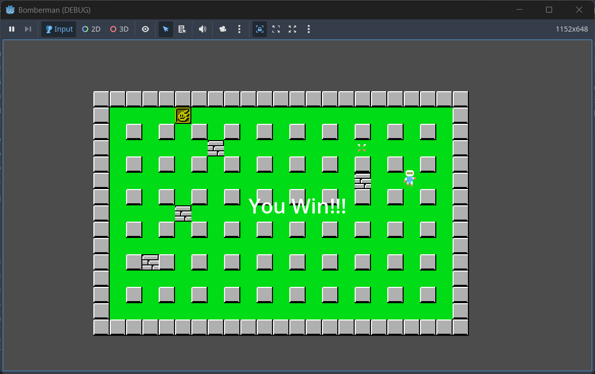

 
## Overview
 
1. Overview: Bomberman is a 2D top-down arcade game developed as part of an academic game project. Inspired by the classic Bomberman franchise, the game features grid-based movement, strategic bomb placement, destructible environments, and power-up collection — all wrapped in a pixel-art style built with Godot Engine.
 
Players navigate a maze filled with indestructible and destructible walls, place bombs to clear paths and defeat enemies, and collect power-ups to gain the upper hand. The goal is simple: survive, outsmart your enemies, and escape.
 

2. Youtube Link: https://youtu.be/Vg8smkeiXIM 

3. Screenshot

